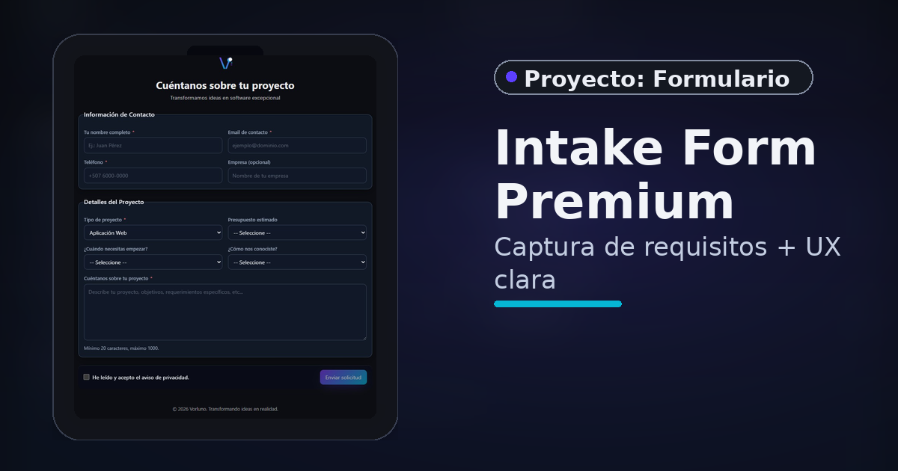

<p align="center">
  <a href="https://contacto.vorluno.dev"><b>🌐 Live Demo</b></a> •
  <a href="#-features"><b>✨ Features</b></a> •
  <a href="#-tech-stack"><b>🧱 Tech Stack</b></a>
</p>

<p align="center">
  
</p>

<p align="center">
  <strong>Intake Form Premium</strong><br/>
  Captura de requisitos + UX clara
</p>

---

<div align="center">

# 🚀 Vorluno Contact Form

**Modern, production-ready contact form built for CapRover deployment**

[](https://dotnet.microsoft.com/)
[](https://reactjs.org/)
[](https://www.docker.com/)
[](https://caprover.com/)
[](LICENSE)

[Features](#-features) •
[Quick Start](#-quick-start) •
[Deployment](#-deployment) •
[Documentation](#-documentation)

</div>

---

## 📋 Overview

Enterprise-grade contact form application for Vorluno, featuring a React frontend with Vite and ASP.NET Core backend. Optimized for CapRover deployment with Docker, complete with email notifications via Brevo and optional Google Sheets integration.

## ✨ Features

### Frontend
- 🎨 **Modern UI**: Vorluno brand colors (#7C3AED violet, #06B6D4 cyan)
- ✅ **Form Validation**: React Hook Form + Zod schema validation
- 📱 **Responsive Design**: Mobile-first with glassmorphism effects
- ♿ **Accessible**: ARIA labels, keyboard navigation, screen reader support
- 🔄 **Offline Support**: Automatic retry queue when connection returns
- 🌐 **i18n Ready**: Spanish language support

### Backend
- ⚡ **ASP.NET Core 9**: Latest .NET with minimal APIs
- 📧 **Email Service**: Brevo (SendinBlue) transactional emails
- 🔒 **Security**: Non-root Docker user, security headers, input validation
- 📊 **Google Sheets**: Optional webhook integration for lead tracking
- 🏥 **Health Checks**: Built-in `/healthz` endpoint
- 📝 **Structured Logging**: Production-ready logging configuration

### DevOps
- 🐳 **Docker**: Multi-stage build, Alpine Linux (~90MB final image)
- 🚢 **CapRover Ready**: One-click deployment with captain-definition
- 🔐 **Environment Variables**: All secrets via env vars, zero hardcoding
- 📦 **Optimized**: Response compression (Brotli + Gzip), static file caching
- 🔄 **CI/CD Ready**: GitHub Actions compatible structure

## 📁 Project Structure

```
vorluno-contact-form/
├── src/
│   ├── api/                          # ASP.NET Core Backend
│   │   ├── Controllers/              # API Controllers
│   │   ├── Models/                   # Data models
│   │   ├── Services/                 # Business logic (Email, etc.)
│   │   ├── wwwroot/                  # Static files (built frontend + assets)
│   │   ├── Program.cs                # Application entry point
│   │   ├── appsettings.json.example  # Config template
│   │   └── appsettings.Production.json
│   └── web/                          # React + Vite Frontend
│       ├── src/
│       │   ├── components/           # React components
│       │   └── lib/                  # Utilities, API client, schemas
│       ├── public/                   # Static assets
│       └── package.json
├── .github/                          # GitHub templates
│   ├── ISSUE_TEMPLATE/
│   └── PULL_REQUEST_TEMPLATE.md
├── Dockerfile                        # Multi-stage production build
├── captain-definition                # CapRover deployment config
├── .env.example                      # Environment variables template
└── LICENSE                           # MIT License
```

## 🚀 Quick Start

### Prerequisites

- [.NET 9 SDK](https://dotnet.microsoft.com/download/dotnet/9.0)
- [Node.js 20+](https://nodejs.org/)
- [Brevo](https://www.brevo.com/) account with API key
- (Optional) [Docker](https://www.docker.com/) for containerized testing

### Local Development

#### 1. Clone and Setup

```bash
git clone https://github.com/YOUR_USERNAME/vorluno-contact-form.git
cd vorluno-contact-form
```

#### 2. Configure Environment

```bash
# Copy example config
cp src/api/appsettings.json.example src/api/appsettings.json

# Edit with your Brevo API key
# Replace YOUR_BREVO_API_KEY_HERE in appsettings.json
```

#### 3. Run Backend

```bash
cd src/api
dotnet restore
dotnet run
```

Backend will be available at `https://localhost:7150`

- Swagger UI: `https://localhost:7150/swagger` (dev only)
- Health Check: `https://localhost:7150/healthz`

#### 4. Run Frontend (New Terminal)

```bash
cd src/web
npm install
npm run dev
```

Frontend will be available at `http://localhost:5174`

### Docker Testing

```bash
# Build image
docker build -t vorluno-contacto:test .

# Run container
docker run -d -p 8080:8080 \
  -e Email__Brevo__ApiKey="your-key" \
  -e Email__From="contacto@vorluno.dev" \
  -e Email__To="your-email@example.com" \
  -e Email__Logo__Url="https://vorluno.dev/assets/vorluno-logo.png" \
  --name contacto-test \
  vorluno-contacto:test

# Test health check
curl http://localhost:8080/healthz

# View logs
docker logs -f contacto-test

# Cleanup
docker stop contacto-test && docker rm contacto-test
```

## 🚢 Deployment

### CapRover (Recommended)

**One-click deployment to CapRover with automatic SSL via Let's Encrypt**

1. **Create app in CapRover**
   ```bash
   # Or via dashboard: Apps > Create New App > "contacto"
   ```

2. **Configure environment variables** (see `.env.example`)
   - `Email__Brevo__ApiKey` (required)
   - `Email__From` (required)
   - `Email__To` (required)
   - `Email__Logo__Url` (required)

3. **Deploy**
   ```bash
   # Option A: From Git (Automatic)
   # Configure in CapRover: Deployment > Deploy from Git

   # Option B: Manual push
   caprover deploy -a contacto
   ```

4. **Enable HTTPS**
   - Go to HTTP Settings
   - Add custom domain: `contacto.vorluno.dev`
   - Enable HTTPS & Force HTTPS
   - CapRover handles SSL cert automatically

---

## 🔧 Configuration

### Environment Variables

All configuration via environment variables. See [`.env.example`](./.env.example) for complete list.

**Required:**
```bash
Email__Brevo__ApiKey=xkeysib-...
Email__From=contacto@vorluno.dev
Email__To=vorluno@gmail.com
Email__Logo__Url=https://vorluno.dev/assets/vorluno-logo.png
```

**Optional:**
```bash
Email__Ack__From=contacto@vorluno.dev
GoogleSheets__WebhookUrl=https://...
GoogleSheets__Token=secret
```

### Email Configuration (Brevo)

Before deploying, configure Brevo:

1. **Verify domain** `vorluno.dev` in Brevo
2. **Add DNS records**:
   - SPF: `v=spf1 include:spf.sendinblue.com ~all`
   - DKIM: (provided by Brevo)
   - DMARC: `v=DMARC1; p=none; rua=mailto:postmaster@vorluno.dev`
3. **Verify sender**: `contacto@vorluno.dev`

---

## 🛠️ Tech Stack

### Backend
- **Framework**: ASP.NET Core 9.0
- **Language**: C# 12
- **Email**: Brevo SDK (brevo-csharp)
- **Validation**: Data Annotations
- **Compression**: Brotli + Gzip

### Frontend
- **Framework**: React 18
- **Build Tool**: Vite 5
- **Validation**: React Hook Form + Zod
- **Styling**: TailwindCSS (implicit via inline styles)
- **HTTP Client**: Axios

### DevOps
- **Container**: Docker (multi-stage)
- **Base Image**: Alpine Linux
- **Orchestration**: CapRover
- **CI/CD**: GitHub Actions ready

---

## 🤝 Contributing

This is a private Vorluno project. For internal team members:

1. Create a feature branch from `master`
2. Make your changes
3. Submit a PR with description
4. Wait for review

### Commit Convention

Follow [Conventional Commits](https://www.conventionalcommits.org/):

```
feat: add Google Sheets integration
fix: resolve email template rendering issue
docs: update deployment guide
chore: bump dependencies
```

---

## 📝 License

MIT License - see [LICENSE](./LICENSE) file for details.

---

## 🔗 Links

- **Production**: https://contacto.vorluno.dev
- **Health Check**: https://contacto.vorluno.dev/healthz
- **Brevo Dashboard**: https://app.brevo.com
- **CapRover**: https://caprover.com

---

## 🙏 Acknowledgments

- Built with [ASP.NET Core](https://dotnet.microsoft.com/)
- Styled with [React](https://react.dev/)
- Deployed on [CapRover](https://caprover.com/)
- Emails via [Brevo](https://www.brevo.com/)

---

<div align="center">

**Made with 💜 by [Vorluno](https://vorluno.dev)**

*Transformando ideas en realidad*

</div>
